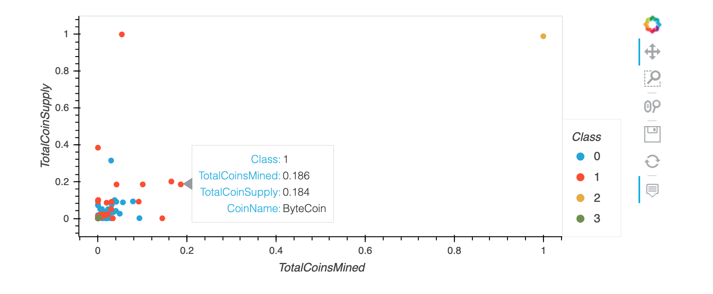

# Cryptocurrencies

## Overview
Cryptocurrencies are digital currencies that can be used to online to purchase goods and services. There are thousands of cryptocurrencies that are currently being publicly traded. As cryptocurrencies become more popular, identifying patterns in how each coin is traded, mined, and supplied may help investors decide on which coins to invest in. 

This project uses principal component analysis (PCA) to identify patterns in how coins cluster together. 

## Results
The cryptocurrency dataset cointained information on ProofType (a consensus on how the cryptocurrency blockchain is operated), total coins mined, total coin supply, and the algorithm used to implement the cyrptocurrency. 

The data was pre-processed to remove coins that are not traded or do not have working algorithms. Coins that had not yet been mined were also removed from the dataset since we are interested in coin mining and supply. 

The resulting data was reduced to three principal components, and scaled using the StandardScaler() from the sklearn library. Then, the KMeans algorithm was used to generate an elbow curve to find the best value for K.

The elbow curve is a measure of variation in the dataset. As K (the number of clusters) increases, the variability in the data (inertia) decreases. The point on the elow curve where the curve flattens is the number of clusters that should be used to analyze the data in the K-Means model. Here, the elbow curve flattens after K=4, thus 4 clusters were used in our K-Means model. This model predicts which of the four clusters (or classes) each coin would group into based on principal component values generated from the scaled data. 

Next, the clustered data was visualized on a 3D scatterplot using hvplot to identify which coins grouped together:

Lastly, we generated a 2D scatter plot to visualize the distribution of each class based on total coins mined vs total coin supply:

## Summary
When reduced to three principal components and clustered using the K-Means model, the cryptocurrency data groups as follows:

- Class 0: Low PC 1, Medium PC2, Low PC3
- Class 1: Low PC 1, Low PC2, Low PC3
- Class 2: High PC 1, Medium PC2, Low PC3
- Class 3: Low PC1, High PC 2, High PC3

In general, all four classes cluster similarly on the 2D scatter plot for total coins mined vs total coin supply, with the exception of a few outliers in classes 1 and 2 (TurtleCoin and BitTorrent respectively). 
